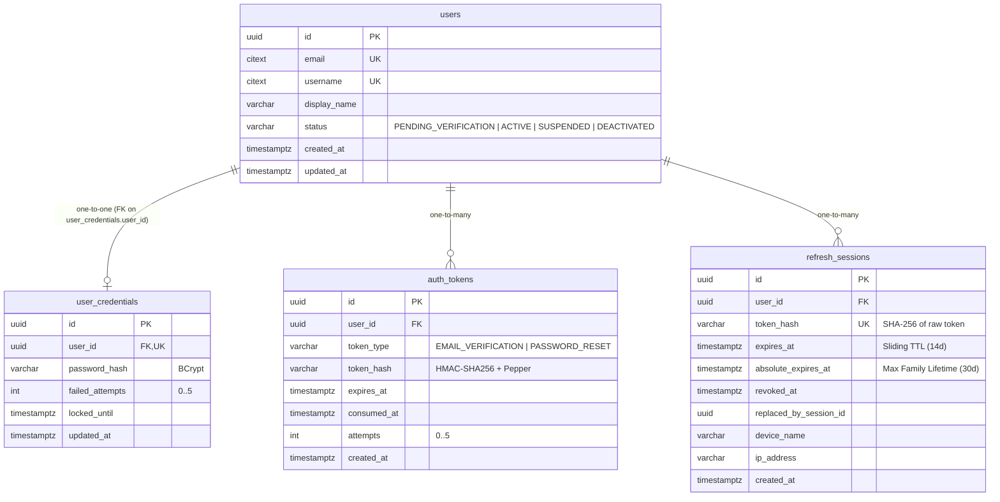

# AI AGENT CONTEXT HANDOFF: MILESTONES M0 – M2
## Dense Technical Handoff, Architectural Memory & Onboarding Guide

> **Document:** `docs/AI_AGENT_HANDOFF_M0_M2.md`<br/>
> **Status:** OFFICIAL SNAPSHOT (M0–M2 Completed)<br/>
> **Target Audience:** Future AI Agents, Pair Programmers, and Engineering Teammates joining the repository.<br/>
> **Prerequisite:** Read [`docs/AI_AGENT_RULES.md`](file:///d:/weDO-app/docs/AI_AGENT_RULES.md) before performing any work.

---

## 1. PROJECT PURPOSE

* **What weDO is:** A collaborative social and group activity platform enabling users to organize real-life activities, manage groups, participate in discussions/polls, track shared expenses, split debts, and manage community group funds.
* **Core Philosophy:** "Backend is the single source of truth for auth, permissions, debts, fund balances, and waitlists; Flutter is a dumb state-renderer that does not decide business truth."
* **Educational & Career Context:** The project is built with dual objectives: delivering a high-quality product and serving as a deep learning and interview preparation vehicle for a university student aiming for a **Backend Intern / Junior Software Engineer** role. Code clarity, defensive architecture, concurrency controls, and comprehensive tests are prioritized over hasty feature accumulation.

---

## 2. CURRENT TECHNOLOGY STACK

* **Backend:** Java 21, Spring Boot 4.1.1, Maven (Wrapper `mvnw`).
  * *Security & Identity:* Spring Security (managed by Spring Boot 4.1.1, verified runtime: 7.1.1), JJWT 0.13.0 (`jjwt-api`, `jjwt-impl`, `jjwt-jackson`), BCrypt password hashing.
  * *Data & ORM:* Spring Data JPA, Hibernate Core (verified runtime: 7.4.5.Final), Flyway Migration (`flyway-database-postgresql`).
  * *Validation & Web:* Spring Boot Starter Validation (Hibernate Validator), Spring Boot Starter WebMVC, Springdoc OpenAPI (starter 3.0.0).
  * *Actuator & Metrics:* Spring Boot Starter Actuator.
* **Mobile:** Flutter (verified local development environment at handoff creation: Flutter 3.47.1, Dart 3.13.1; Dart SDK constraint from `pubspec.yaml`: `sdk: ^3.13.1`), Material 3.
  * *Networking:* Dio 5.11.1 (custom interceptors), HTTP 1.6.0 (healthcheck bootstrap).
  * *Security Storage:* `flutter_secure_storage` 11.0.0 (OS/platform-backed secure credential storage: Apple Keychain on iOS; Android secure storage mechanisms managed by the plugin/platform). Production auth credentials are strictly persisted through the `SecureKeyValueStore` / `SecureStorageService` abstraction.
  * *Routing:* Native Flutter Navigator 1.0 (`onGenerateRoute`), fail-closed route guard.
* **Database & Cache Infrastructure:**
  * *Relational DB:* PostgreSQL 17.11 (Alpine) running on port `5432` with extensions `uuid-ossp` and `citext`.
  * *In-Memory Cache:* Redis 7.4 (Alpine) running on port `6379` (provisioned for future realtime/caching).
  * *Local Orchestration:* Docker Compose via `infra/docker-compose.yml`.
* **Testing Infrastructure:**
  * *Backend:* JUnit 5, Mockito, Spring Boot Starter Test, **Testcontainers 1.21.3** (`testcontainers:postgresql:17-alpine`).
  * *Mobile:* Flutter Test, in-memory test doubles, `mobile/test_e2e/live_auth_e2e_test.dart`.

---

## 3. CURRENT GIT CHECKPOINT (SNAPSHOT)

> ⚠️ **IMPORTANT TO FUTURE AGENTS:** The following checkpoint reflects the repository state at the conclusion of Milestone 2. **Do not assume these hashes remain eternal.** Always run the commands below to determine current reality:
> ```bash
> git branch --show-current
> git log -1 --oneline
> git status --short
> ```

* **Branch at Creation:** `feat/m2-auth-security`
* **Closure Commit Hash:** `a96457c` — `docs: close milestone 2 auth foundation`
* **Working Tree State:** Clean baseline before documentation additions.

---

## 4. MILESTONE STATUS MATRIX

* **M0 (Repository + Bootstrap):** **COMPLETE** (Bootstrap, Docker Compose, Healthcheck, CI skeleton).
* **M1 (Database Foundation + Common Infrastructure):** **COMPLETE** (Flyway V0–V10, Error handling, Request ID MDC, UTC Clock, PagedResponse, Testcontainers).
* **M2 (Authentication + Security):** **COMPLETE** (Sub-milestones M2.1 through M2.16 fully implemented and verified with Live E2E).
* **M3 (User Profile + Privacy):** **NOT STARTED** as of this snapshot creation.
* *Note:* Future agents must check [`docs/DEVELOPMENT_PLAN_MILESTONES_v1.0_FULL.md`](file:///d:/weDO-app/docs/DEVELOPMENT_PLAN_MILESTONES_v1.0_FULL.md) for the active milestone.

---

## 5. M0 IMPLEMENTED STATE (SUMMARY)

* Initialized unified monorepo layout containing `backend/`, `mobile/`, `infra/`, `docs/`, and `.github/`.
* Containerized local infrastructure via `infra/docker-compose.yml` with healthchecks (`pg_isready`).
* Created backend health endpoint `/api/v1/health` returning `{"status":"UP"}` and exposed Actuator health.
* Implemented Flutter client network health probe in `mobile/lib/core/network/health_service.dart`.
* Standardized root documentation, `.gitignore`, and Maven/Gradle/Flutter build wrappers.

---

## 6. M1 IMPLEMENTED STATE (SUMMARY)

* **Flyway Migrations (V0 – V10):** Structured relational schema for identity, social, groups, chat, activities, polls/tasks, finance, group funds, notifications, and cross-module performance indexes.
* **Unified Error Infrastructure:**
  * `ErrorCode` enum: Standardized string error codes across all business domains.
  * `BusinessException`: Unchecked base exception mapping directly to HTTP status and `ErrorCode`.
  * `GlobalExceptionHandler` (`@RestControllerAdvice`): Converts validation errors and domain exceptions into a uniform JSON response (`ApiErrorResponse`).
* **Traceability:** `RequestIdFilter` generates UUID `X-Request-Id`, binds to SLF4J MDC, and sets HTTP response header.
* **Deterministic Time:** `TimeConfig` supplies a Spring Bean `Clock.systemUTC()` for testable time operations.
* **Pagination:** Generic immutable `PagedResponse<T>` wrapper.
* **Integration Testing Base:** `AbstractPostgresIntegrationTest` spins up real PostgreSQL 17 using Testcontainers and dynamic datasource properties.

---

## 7. M2.1 THROUGH M2.16 IMPLEMENTATION BREAKDOWN

| Sub-Milestone | Goal | Key Files | Core Architecture & Security Decisions | Status |
| :--- | :--- | :--- | :--- | :--- |
| **M2.1** Auth JPA Mapping | Map identity schema to JPA entities | `UserEntity.java`, `UserCredentialEntity.java`, `AuthTokenEntity.java`, `RefreshSessionEntity.java` | Decoupled public user profile (`users`) from security secrets (`user_credentials`) to prevent accidental credential leakage in API responses. | **COMPLETE** |
| **M2.2** Security Foundation | Spring Security base configuration & hashing | `SecurityConfig.java`, `PasswordEncoderTest.java` | Configured stateless filter chain, disabled CSRF for REST, registered `BCryptPasswordEncoder` (work factor 10) with automatic per-hash salt. | **COMPLETE** |
| **M2.3** JWT Foundation | Stateless access token service | `JwtService.java`, `JwtServiceTest.java` | HMAC-SHA256 signing (>=256-bit secret), claims extraction, expiration parsing, isolated token generation using injected UTC Clock. | **COMPLETE** |
| **M2.4** User Registration | Account registration endpoint | `AuthController.java`, `AuthService.java#register` | Validates email/password, checks email uniqueness (`citext`), hashes password, seeds notification/privacy settings, hashes OTP via peppered HMAC, publishes `EmailVerificationRequestedEvent`. | **COMPLETE** |
| **M2.5** Email Verification | OTP email verification & resend | `AuthService.java#verifyEmail`, `VerificationCodeGenerator.java` | 15-minute OTP TTL, max 5 failed attempts per OTP token, 60-second resend cooldown, issues single-purpose `profileCompletionToken` upon verification. | **COMPLETE** |
| **M2.6** Profile Completion | Complete onboarding & username reservation | `ProfileCompletionTokenService.java`, `AuthController.java` | Dedicated JWT purpose claim (`purpose: COMPLETE_PROFILE`); validates regex username `^[a-zA-Z0-9_]{3,30}$` on `citext`; transitions user to ready for login. | **COMPLETE** |
| **M2.7** Login & Initial Session | Authentication & credential rate-limiting | `AuthService.java#login`, `RefreshTokenService.java` | Failed attempt tracker with lockout (5 attempts -> 15m lock); `@Transactional(noRollbackFor = LoginAttemptException.class)` to commit failure counts; constant-time dummy BCrypt check against timing attacks; issues initial Access Token & Refresh Session. | **COMPLETE** |
| **M2.8** Refresh Token Rotation | Token rotation endpoint | `AuthService.java#refreshToken`, `RefreshSessionRepository.java` | Refresh token rotation: $R_1 \to R_2$; $R_1$ revoked and linked to $R_2$ (`replacedBySessionId`); raw refresh token is 32 random bytes stored strictly as SHA-256 hex digest. | **COMPLETE** |
| **M2.9** Logout | Remote session revocation | `AuthService.java#logout` | Idempotent revocation of active refresh session; returns HTTP 204; throws `REFRESH_TOKEN_INVALID` if attempting logout with an already rotated token. | **COMPLETE** |
| **M2.10** Password Recovery | Forgot/Reset password flows | `AuthService.java#forgotPassword`, `resetPassword` | Anti-enumeration response on forgot password; OTP reset code with 5-attempt limit; revokes all active refresh sessions for user upon successful password reset. | **COMPLETE** |
| **M2.11** Bearer Auth & Current User | Protected `/api/v1/me` endpoint | `JwtAuthenticationFilter.java`, `UserController.java` | `OncePerRequestFilter` extracts Bearer token, populates `AuthenticatedUserPrincipal` in `SecurityContextHolder`; formats 401 `AUTH_TOKEN_EXPIRED` and `AUTH_TOKEN_INVALID` via `SecurityErrorResponseWriter`. | **COMPLETE** |
| **M2.12** Session Hardening | Sliding vs Absolute TTL & metadata | `V11__session_family_hardening.sql`, `RefreshSessionEntity.java` | Added `absolute_expires_at` (max 30 days family lifetime) alongside sliding TTL (14 days); captures client device name and IP address. | **COMPLETE** |
| **M2.13** Flutter Auth Screens | Presentation screen foundation | `mobile/lib/features/auth/presentation/screens/**` | Implemented all 8 Material 3 auth screens (`Welcome`, `Register`, `VerifyEmail`, `CreateUsername`, `CompleteProfile`, `Login`, `ForgotPassword`, `ResetPassword`) and auto-focus `OtpCodeField`. | **COMPLETE** |
| **M2.14** Storage & Network Core | Secure storage & Dio interceptor | `secure_storage_service.dart`, `access_token_holder.dart`, `dio_client.dart` | `SecureStorageService` over `flutter_secure_storage`; in-memory `AccessTokenHolder`; basic Bearer attachment. | **COMPLETE** |
| **M2.15** Refresh Lifecycle & Guard | Concurrency-safe auth interceptor & guard | `auth_interceptor.dart`, `auth_session_controller.dart`, `auth_route_guard.dart`, `auth_repository.dart` | Single-flight refresh; stale-401 resolution; TOCTOU dispatch check; session generation (`revision`) tracking; FIFO credential mutation queue; fail-closed route guard. | **COMPLETE** |
| **M2.16** Live E2E Verification | Live integration verification | `mobile/test_e2e/live_auth_e2e_test.dart`, `OtpResolverTest.java` | Verified full 9-phase canonical auth lifecycle against real Spring Boot + real PostgreSQL 17 in ~19s. Zero production code changes. | **COMPLETE** |

---

## 8. BACKEND PACKAGE MAP

```text
com.wedo.backend
├── BackendApplication.java                     # Spring Boot main class
├── common/
│   ├── config/TimeConfig.java                  # UTC Clock bean
│   ├── dto/PagedResponse.java                  # Generic pagination envelope
│   ├── error/
│   │   ├── ApiErrorResponse.java               # Standard error JSON DTO
│   │   ├── BusinessException.java              # Base domain runtime exception
│   │   ├── ErrorCode.java                      # Domain error codes enum
│   │   └── GlobalExceptionHandler.java         # @RestControllerAdvice
│   ├── filter/RequestIdFilter.java             # X-Request-Id servlet filter & MDC
│   └── health/HealthController.java            # /api/v1/health public endpoint
├── security/
│   ├── AuthenticatedUserPrincipal.java         # Principal inside SecurityContext
│   ├── RestAccessDeniedHandler.java            # 403 Forbidden handler
│   ├── RestAuthenticationEntryPoint.java       # 401 Unauthorized handler
│   ├── SecurityConfig.java                     # Spring Security filter chain configuration
│   ├── SecurityErrorResponseWriter.java        # Formats JSON errors from filters
│   └── jwt/
│       ├── JwtAuthenticationFilter.java        # OncePerRequestFilter for Bearer JWT
│       └── JwtService.java                     # JWT creation, signing, parsing
├── user/
│   ├── controller/UserController.java          # GET /api/v1/me
│   ├── dto/MyProfileResponse.java              # Profile representation DTO
│   ├── entity/
│   │   ├── UserEntity.java                     # 'users' table JPA entity
│   │   ├── UserCredentialEntity.java           # 'user_credentials' JPA entity
│   │   ├── UserPrivacySettingsEntity.java      # 'user_privacy_settings' JPA entity
│   │   ├── UserStatus.java                     # PENDING_VERIFICATION, ACTIVE, SUSPENDED, DEACTIVATED
│   │   ├── DmPolicy.java                       # EVERYONE, FRIENDS_ONLY, NO_ONE
│   │   └── FriendRequestPolicy.java            # EVERYONE, FRIENDS_OF_FRIENDS, NO_ONE
│   ├── repository/
│   │   ├── UserRepository.java                 # findByEmail, findByUsername, citext native queries
│   │   ├── UserCredentialRepository.java       # findByUserIdWithLock (PESSIMISTIC_WRITE)
│   │   └── UserPrivacySettingsRepository.java
│   └── service/UserService.java                # Profile retrieval logic
└── auth/
    ├── controller/AuthController.java          # POST /register, /login, /refresh, /logout, etc.
    ├── dto/                                    # Request/Response records (RegisterRequest, etc.)
    ├── entity/
    │   ├── AuthTokenEntity.java                # 'auth_tokens' table JPA entity
    │   ├── AuthTokenType.java                  # EMAIL_VERIFICATION, PASSWORD_RESET
    │   └── RefreshSessionEntity.java           # 'refresh_sessions' table JPA entity
    ├── event/                                  # Spring application events (EmailVerificationRequestedEvent)
    ├── exception/                              # LoginAttemptException, RefreshSessionStatusException
    ├── repository/
    │   ├── AuthTokenRepository.java            # Token lookup & attempt updates
    │   └── RefreshSessionRepository.java       # findByTokenHashWithLock (PESSIMISTIC_WRITE)
    ├── security/
    │   ├── AuthTokenHasher.java                # HMAC-SHA256 with Pepper for OTPs
    │   ├── ProfileCompletionTokenService.java  # Purpose-bound onboarding JWT
    │   ├── RefreshTokenService.java            # 32-byte SecureRandom & SHA-256 token hashing
    │   └── VerificationCodeGenerator.java      # 6-digit cryptographic random generator
    └── service/AuthService.java                # Transactional orchestrator for auth business logic
```

---

## 9. DATABASE MIGRATION MAP

The database schema is strictly versioned by Flyway. Notice the milestone boundary:

* **Milestone 1 Migrations:**
  1. `V0__bootstrap.sql`: Activates PostgreSQL extensions `uuid-ossp` and `citext`.
  2. `V1__identity_and_auth.sql`: Creates `users`, `user_credentials`, `auth_tokens`, `refresh_sessions`.
  3. `V2__social.sql`: Creates `friendships`, `friend_requests`, `user_blocks`.
  4. `V3__groups.sql`: Creates `groups`, `group_settings`, `group_memberships`, `group_invitations`, `group_join_requests`, `group_activity_logs`.
  5. `V4__chat.sql`: Creates `chat_channels`, `chat_messages`, `chat_attachments`, `chat_reads`.
  6. `V5__activities.sql`: Creates `activities`, `activity_participants`, `activity_comments`.
  7. `V6__poll_task_discussion.sql`: Creates `polls`, `poll_options`, `poll_votes`, `tasks`, `task_assignments`, `discussions`.
  8. `V7__finance.sql`: Creates `expenses`, `expense_splits`, `settlements`.
  9. `V8__fund.sql`: Creates `group_funds`, `fund_campaigns`, `fund_transactions`.
  10. `V9__notifications.sql`: Creates `notifications`, `user_notification_settings`.
  11. `V10__cross_module_indexes.sql`: Cross-module foreign key and query performance indexes.
* **Milestone 2 Migration:**
  12. `V11__session_family_hardening.sql`: Schema evolution adding `absolute_expires_at` and `replaced_by_session_id` to `refresh_sessions`.

*(Do NOT state that M1 created all 12 migrations. M1 created V0–V10; M2.12 created V11).*

---

## 10. AUTH DATABASE MODEL



---

## 11. AUTH API CONTRACT MATRIX

| Method | Endpoint Path | Auth Required | Purpose | Success Status | Key Error Codes |
| :--- | :--- | :--- | :--- | :--- | :--- |
| `POST` | `/api/v1/auth/register` | Public | Register new user account | `201 Created` | `VALIDATION_FAILED`, `EMAIL_ALREADY_EXISTS` |
| `POST` | `/api/v1/auth/verify-email` | Public | Verify email OTP code | `200 OK` | `TOKEN_EXPIRED`, `TOKEN_INVALID`, `TOKEN_MAX_ATTEMPTS_EXCEEDED` |
| `POST` | `/api/v1/auth/resend-verification` | Public | Resend email OTP code | `200 OK` | `RESEND_COOLDOWN_ACTIVE`, `USER_NOT_FOUND` |
| `GET` | `/api/v1/auth/usernames/{username}/availability` | Public | Check username availability | `200 OK` | `INVALID_USERNAME_FORMAT` |
| `POST` | `/api/v1/auth/complete-profile` | Public (Token) | Set username & profile using token | `200 OK` | `TOKEN_EXPIRED`, `TOKEN_INVALID`, `USERNAME_ALREADY_EXISTS` |
| `POST` | `/api/v1/auth/login` | Public | Authenticate user & issue session | `200 OK` | `AUTH_INVALID_CREDENTIALS`, `ACCOUNT_LOCKED`, `EMAIL_NOT_VERIFIED`, `ACCOUNT_SUSPENDED` |
| `POST` | `/api/v1/auth/refresh` | Public | Rotate refresh token for new tokens | `200 OK` | `REFRESH_TOKEN_INVALID`, `ACCOUNT_SUSPENDED`, `ACCOUNT_DEACTIVATED` |
| `POST` | `/api/v1/auth/logout` | Public | Revoke active refresh session | `204 No Content` | `REFRESH_TOKEN_INVALID` (if rotated), `VALIDATION_FAILED` |
| `POST` | `/api/v1/auth/forgot-password` | Public | Request password reset OTP | `200 OK` | Anti-enumeration (always 200) |
| `POST` | `/api/v1/auth/reset-password` | Public | Reset password using OTP | `200 OK` | `TOKEN_EXPIRED`, `TOKEN_INVALID`, `TOKEN_MAX_ATTEMPTS_EXCEEDED` |
| `GET` | `/api/v1/me` | Bearer JWT | Retrieve current user profile | `200 OK` | `AUTH_TOKEN_EXPIRED`, `AUTH_TOKEN_INVALID`, `UNAUTHORIZED` |

---

## 12. COMPLETE REGISTER FLOW TRACE

```text
1. RegisterScreen: User inputs email & password -> clicks Register.
2. AuthFlowCoordinator#handleRegister: Validates syntax -> calls AuthRepository#register.
3. AuthRepository#register: Normalizes email (.trim().toLowerCase()) -> calls AuthApi#register.
4. AuthApi#register: Sends HTTP POST /api/v1/auth/register via Dio.
5. RequestIdFilter: Intercepts request, attaches X-Request-Id UUID to MDC and response header.
6. AuthController#register: Receives @Valid RegisterRequest DTO.
7. AuthService#register:
   a. Checks userRepository.findByEmail(normalizedEmail) using citext.
   b. Creates UserEntity(status = PENDING_VERIFICATION).
   c. Hashes password via passwordEncoder.encode(password) (BCrypt).
   d. Saves UserEntity & UserCredentialEntity.
   e. Seeds UserPrivacySettingsEntity & UserNotificationSettingsEntity.
   f. Generates 6-digit OTP code via VerificationCodeGenerator.
   g. Hashes OTP with pepper via AuthTokenHasher#hash(userId, EMAIL_VERIFICATION, rawCode).
   h. Saves AuthTokenEntity (TTL 15m).
   i. Publishes EmailVerificationRequestedEvent.
8. AuthController: Returns HTTP 201 Created with RegisterResponse(userId, email).
9. AuthFlowCoordinator: Navigates to VerifyEmailScreen with email and cooldown timer.
```

---

## 13. VERIFY & PROFILE COMPLETION FLOW TRACE

```text
1. VerifyEmailScreen: User inputs 6-digit code -> calls AuthFlowCoordinator#handleVerifyEmail.
2. AuthRepository#verifyEmail -> AuthApi#verifyEmail -> POST /api/v1/auth/verify-email.
3. AuthService#verifyEmail:
   a. Finds latest unconsumed AuthTokenEntity for user and type EMAIL_VERIFICATION.
   b. Verifies attempts < 5 and not expired.
   c. Constant-time matches code hash via AuthTokenHasher#matches (HMAC-SHA256).
   d. Increments attempts on failure; marks consumedAt on success.
   e. Transitions UserEntity to status = ACTIVE.
   f. Generates profileCompletionToken via ProfileCompletionTokenService#generate (purpose: COMPLETE_PROFILE, TTL 15m).
4. AuthController: Returns HTTP 200 OK with VerifyEmailResponse(userId, status: ACTIVE, emailVerifiedAt, nextStep: COMPLETE_PROFILE, profileCompletionToken).
5. AuthFlowCoordinator: Navigates to CreateUsernameScreen -> CompleteProfileScreen.
6. CompleteProfileScreen: User fills username and display name -> calls completeProfile.
7. AuthService#completeProfile:
   a. Validates & parses profileCompletionToken (checks signing key and purpose claim).
   b. Validates username regex and citext availability.
   c. Updates user.username, user.displayName, bio, avatarStorageKey.
8. AuthController: Returns HTTP 200 OK with CompleteProfileResponse(userId, username, displayName, status: ACTIVE, nextStep: LOGIN).
9. AuthFlowCoordinator: Navigates to LoginScreen with success prompt.
```

---

## 14. LOGIN FLOW TRACE

```text
1. LoginScreen: User enters email & password -> calls AuthFlowCoordinator#handleLogin.
2. AuthRepository#login:
   a. Normalizes email.
   b. Calls AuthApi#login -> POST /api/v1/auth/login.
3. AuthService#login:
   a. Finds user by email; if absent, executes dummy BCrypt check and throws AUTH_INVALID_CREDENTIALS.
   b. Acquires pessimistic lock: userCredentialRepository.findByUserIdWithLock(user.getId()).
   c. Evaluates lockedUntil: if locked, throws ACCOUNT_LOCKED without incrementing lock time.
   d. Checks passwordEncoder.matches(password, credential.passwordHash).
      - If mismatch: increments failedAttempts; if >= 5, sets lockedUntil = now + 15m; throws LoginAttemptException.
      - If match: resets failedAttempts = 0, lockedUntil = null.
   e. Verifies UserStatus (PENDING_VERIFICATION -> EMAIL_NOT_VERIFIED; SUSPENDED -> ACCOUNT_SUSPENDED).
   f. If username is null: returns LoginResponse.recovery with new profileCompletionToken.
   g. Generates Access Token JWT via JwtService#generateAccessToken(userId) (TTL 15m).
   h. Issues new Refresh Session via RefreshTokenService#issue:
      - 32-byte SecureRandom raw token.
      - Hashes to SHA-256 hex digest.
      - Saves RefreshSessionEntity (expiresAt = now + 14d, absoluteExpiresAt = now + 30d).
4. AuthController: Returns HTTP 200 OK with LoginResponse.authenticated.
5. AuthRepository#login (Adoption):
   a. Enters _credentialMutationQueue.
   b. Writes accessToken and refreshToken to SecureStorageService.
   c. Updates AccessTokenHolder.setAccessToken(accessToken) -> revision increments.
6. AuthSessionController: markAuthenticated() -> updates observable AuthSessionStatus. AppRoutes/onGenerateRoute consults current session status when constructing guarded routes, while AuthRouteGuard acts as a pure policy evaluator (not an active reactive listener). Current architecture does not provide reactive eviction of an already-visible screen (deferred).
7. LoginScreen: Receives success; currently displays SnackBar ("Signed in successfully.") and remains on screen (App Shell deferred to M17).
```

---

## 15. PROTECTED REQUEST FLOW (`GET /api/v1/me`)

```text
1. Mobile calls AuthRepository#getCurrentUser -> AuthApi#getCurrentUser -> dio.get('/api/v1/me').
2. AuthInterceptor#onRequest:
   a. Identifies path is not public.
   b. Extracts accessToken from AccessTokenHolder.
   c. Injects Authorization: Bearer <accessToken> header.
   d. Records @wedo/auth_request_revision = accessTokenHolder.revision in request options.
3. Network Transport: Sends request to Spring Boot port 8080.
4. JwtAuthenticationFilter#doFilterInternal:
   a. Reads Authorization header; verifies starts with 'Bearer '.
   b. Calls JwtService#extractUserId(rawToken):
      - Parses HMAC-SHA256 signature using signing key.
      - If ExpiredJwtException -> SecurityErrorResponseWriter outputs 401 AUTH_TOKEN_EXPIRED.
      - If JwtException -> SecurityErrorResponseWriter outputs 401 AUTH_TOKEN_INVALID.
   c. If valid: Creates AuthenticatedUserPrincipal(userId) and sets UsernamePasswordAuthenticationToken in SecurityContextHolder.
5. Spring Security AuthorizationFilter: Passes (authenticated).
6. UserController#getMyProfile(@AuthenticationPrincipal AuthenticatedUserPrincipal principal):
   a. Queries userService.getCurrentUser(principal.userId()).
   b. Returns MyProfileResponse DTO (id, username, email, phone, displayName, avatarStorageKey, bio, status, emailVerified).
7. Mobile receives HTTP 200 OK with JSON profile payload.
```

---

## 16. REFRESH FLOW & SINGLE-FLIGHT RECOVERY

```text
1. Protected request receives HTTP 401.
2. AuthInterceptor#onError:
   a. Checks status == 401 and error code == 'AUTH_TOKEN_EXPIRED'.
   b. Checks _retried == false and extracts requestRev.
   c. Stale-401 Check: If requestRev matches lastTransition.fromRevision and currentRev == lastTransition.toRevision:
      - Bypasses refresh entirely -> calls _retryRequest using lastTransition.toRevision.
   d. Active Session Check: If requestRev == currentRev:
      - Checks single-flight: If _activeRefreshFuture != null and _activeRefreshFromRevision == requestRev, joins existing Future!
      - If no refresh active: Initiates _performRefresh(requestRev).
3. AuthRepository#refreshSession(expectedRevision):
   a. Step 1 (Snapshot): Inside _mutationQueue, verifies revision == expectedRevision; reads refreshToken from SecureStorageService.
   b. Step 2 (Network): Calls isolated AuthApi#refreshToken(refreshToken) OUTSIDE mutation queue -> POST /api/v1/auth/refresh.
   c. Backend AuthService#refreshToken:
      - Hashes incoming raw token with SHA-256.
      - Acquires user credential lock: userCredentialRepository.findByUserIdWithLock(preUserId).
      - Acquires session row lock: refreshSessionRepository.findByTokenHashWithLock(tokenHash) (PESSIMISTIC_WRITE).
      - Checks revokedAt == null and expiresAt/absoluteExpiresAt in future.
      - Generates new Access Token A2 and issues new Refresh Session S2 (raw token R2).
      - Marks old session S1: revokedAt = now, replacedBySessionId = S2.id.
      - Commits transaction; returns HTTP 200 OK with A2, R2.
   d. Step 3 (Adopt): Inside _mutationQueue, verifies revision == expectedRevision:
      - Writes A2 and R2 to SecureStorageService.
      - Calls AccessTokenHolder.setAccessToken(A2) -> revision increments: expectedRevision -> toRevision.
      - Returns SessionRevisionTransition(expectedRevision -> toRevision).
4. AuthInterceptor: Records lastTransition; invokes _retryRequest with targetRevision = toRevision.
5. AuthInterceptor#onRequest (TOCTOU Check on Retry):
   - Verifies accessTokenHolder.revision == targetRevision and token is not blank before sending bytes.
   - Re-dispatches request with A2; returns original HTTP 200 response to caller.
```

---

## 17. SESSION GENERATION CONCURRENCY MODEL

The mobile client enforces generation-aware protection against concurrent asynchronous request and session races using **Session Generations**:

1. **`AccessTokenHolder.revision`:** Integer counter incrementing on every credential mutation (`setAccessToken`, `clearAccessToken`). Serves as the authoritative generation identifier.
2. **`SessionRevisionTransition`:** Value object capturing `fromRevision -> toRevision` across a successful token rotation.
3. **Generation-Scoped Single-Flight:** If 10 concurrent requests receive 401 simultaneously at revision $N$, exactly **one** refresh request is sent to the server. The other 9 await the active Future.
4. **Stale-401 Resolution:** A delayed 401 sent under revision $N$ that arrives *after* revision $N \to N+1$ has already completed does not trigger a second refresh; it immediately adopts $N+1$ and retries.
5. **TOCTOU Guard:** A request approved for retry at revision $N+1$ re-checks `revision == targetRevision` immediately prior to dispatching bytes on the wire. If the user logged out or switched accounts during context switching, the retry is aborted instantly.
6. **Credential Mutation Queue:** FIFO asynchronous queue (`_mutationQueue` in `AuthRepository`) guaranteeing that storage writes and RAM updates are strictly serialized. Network calls occur outside the queue to prevent blocking.
7. **Generation-Aware Invalidation:** An invalidation request targeting revision $N$ aborts if the session has advanced to $N+1$ (`SessionInvalidationSuperseded`), preventing an expired request from logging out a newly authenticated user.

---

## 18. LOGOUT ARCHITECTURE & RESIDUAL WINDOW

* **Canonical Logout Flow:**
  1. User initiates logout -> `AuthRepository.logout()`.
  2. Reads `refreshToken` from `SecureStorageService`.
  3. Sends `POST /api/v1/auth/logout` via `AuthApi`.
  4. Backend `AuthService#logout` acquires lock on `refresh_sessions`, sets `revoked_at = now()`, commits.
  5. Mobile `finally` block executes `clearLocalSession()`: deletes secure storage keys and clears `AccessTokenHolder` RAM.
* **Documented Stateless JWT Residual-Window Limitation:**
  * Because Access Tokens are stateless JWTs, the backend does not query the database on every protected request.
  * If a double-fault occurs (remote logout succeeds, but client local secure storage deletion fails, and the app restarts before the Access Token naturally expires), the restored Access Token remains usable until its `exp` timestamp.
  * Once expired, any refresh attempt is rejected by the server with `401 REFRESH_TOKEN_INVALID`, triggering immediate local eviction.
  * This is an intentional architectural trade-off of the current stateless access-token design.

---

## 19. SESSION RESTORATION ARCHITECTURE

Executed at app startup via `AuthSessionController#restoreSession()`:

* **Both Access & Refresh Tokens Present:** Populates `AccessTokenHolder.setAccessToken(...)`, sets `status = authenticated`. **Zero network calls are made.** Token validity is validated lazily on the first protected request.
* **No Tokens Present:** Clears RAM holder, sets `status = unauthenticated`.
* **Corrupt / Partial Pair (Access only or Refresh only):** Calls `repository.clearLocalSession()` to purge invalid state, sets `status = unauthenticated`.
* **Storage Read Exception:** Clears RAM holder only, sets `status = unauthenticated` (does not clear durable storage, avoiding data loss if Keychain is temporarily locked).

---

## 20. ROUTE GUARD & APPLICATION NAVIGATION

* **Navigation System:** Pure Navigator 1.0 using `onGenerateRoute` in `AppRoutes`.
* **Access Control:** Every route declares `AppRouteAccess.public` or `AppRouteAccess.authenticated`.
* **Policy Evaluator:** `AuthRouteGuard.evaluate(access, authStatus)`:
  * Public routes are allowed for all session states.
  * Authenticated routes are denied if `unauthenticated` or `restoring`.
* **Fail-Closed Registry:** Any unknown or unregistered route path fails closed: `AppRoutes` returns `null` (does not construct an authorized route). There is currently no fake authenticated fallback route.
* **Current State:** No authenticated application shell (Home/Dashboard) exists yet. Upon login, the user legitimately remains on `LoginScreen` with success feedback.

---

## 21. ERROR MODEL HIERARCHY

```text
Backend:
PostgreSQL Constraint Violation / Domain Failure
  ↓
BusinessException(ErrorCode)
  ↓
GlobalExceptionHandler (@RestControllerAdvice)
  ↓
ApiErrorResponse { code, message, requestId, timestamp } (HTTP 4xx / 5xx)

Transport:
HTTP / JSON Payload

Mobile:
Dio Response Error
  ↓
ApiException(statusCode, code, message, requestId)
  ↓
AuthFailure.fromApi(apiException) -> AuthFailureType enum
  ↓
AuthException(AuthFailure)
  ↓
AuthFlowCoordinator (Translates to localized UI user message)
  ↓
Screen SnackBar / Visual State
```

---

## 22. CURRENT SOURCE/TEST-BACKED SECURITY INVARIANTS

Future agents must preserve these 12 invariants unless an explicitly approved redesign changes them:

1. **Account Isolation:** An old request from revision $N$ must never hijack, refresh, or clear a newer revision $N+1$ session.
2. **Rotation Integrity:** An old refresh operation must not overwrite credentials from a newer login.
3. **No Zombie Sessions:** An old refresh token must not resurrect a logged-out session.
4. **Generation Single-Flight:** Requests from different session generations must not join the same refresh Future.
5. **Exact Invalidation:** Invalidation requests apply only if the current session matches the target generation (`SessionInvalidationApplied` vs `SessionInvalidationSuperseded`).
6. **Strict Refresh Trigger:** Automatic refresh is triggered **ONLY** on HTTP 401 with error code `AUTH_TOKEN_EXPIRED`.
7. **Invalid Tokens Fail Closed:** `AUTH_TOKEN_INVALID`, `AUTH_INVALID_CREDENTIALS`, and generic `UNAUTHORIZED` must **NEVER** trigger automatic refresh.
8. **TOCTOU Protection:** Retry authorization must verify that the session generation and token remain valid immediately before physical network dispatch.
9. **Stale-401 Defense:** A late 401 arriving after a successful transition from $N \to N+1$ must retry immediately using the proven transition without firing a redundant refresh.
10. **Adoption Order:** When rotating tokens, validate response $\to$ write durable storage $\to$ update `AccessTokenHolder` RAM $\to$ release waiting requests.
11. **Queue Resilience:** The credential mutation FIFO queue must recover after errors; a failed mutation Future must never poison subsequent operations.
12. **Zero Secret Leakage:** Raw passwords, OTPs, reset codes, JWT secrets, peppers, and tokens must **NEVER** be logged, printed, or exposed in commit history.

---

## 23. TESTING ARCHITECTURE & PYRAMID

* **Backend Test Suite (263 Tests):**
  * *Unit Tests:* `PasswordEncoderTest`, `JwtServiceTest`, `AuthTokenHasherTest`, `VerificationCodeGeneratorTest`, `PagedResponseTest`, `TimeConfigTest`.
  * *Integration / Security Tests:* `AuthControllerTest`, `AuthServiceTest`, `SecurityConfigTest`, `RestAccessDeniedHandlerTest`, `UserControllerTest`.
  * *Database Integration Base:* `AbstractPostgresIntegrationTest` spins up Testcontainers PostgreSQL 17 Alpine dynamically.
* **Mobile Test Suite (262 Tests):**
  * *Unit & Storage:* `access_token_holder_test.dart`, `secure_storage_service_test.dart`, `api_config_test.dart`.
  * *Application & Interceptor:* `auth_interceptor_test.dart` (34KB exhaustive race coverage), `auth_session_controller_test.dart`, `auth_session_invalidator_test.dart`.
  * *Repository & Integration:* `auth_repository_test.dart`, `auth_api_test.dart`, `auth_session_integration_test.dart`.
  * *Presentation & Routing:* Screen widget tests, `auth_flow_coordinator_test.dart`, `auth_route_guard_test.dart`, `routes_test.dart`.
* **Live Integration E2E:**
  * `mobile/test_e2e/live_auth_e2e_test.dart` runs against live backend and live PostgreSQL.

---

## 24. M2.16 LIVE E2E EVIDENCE SUMMARY

* **Execution Command:**
  ```powershell
  flutter test test_e2e/live_auth_e2e_test.dart --dart-define=WEDO_API_BASE_URL=http://127.0.0.1:8080
  ```
* **Runtime Stack:** Real Spring Boot 4.1.1 (profile `local`, `--security.jwt.access-token-ttl=5s`) + real PostgreSQL 17.11 (`wedo-postgres` on port 5432).
* **Execution Metrics:** 9 consecutive phases completed in ~19 seconds (`00:19 +1: All tests passed!`).
* **Canonical Flow Proven:**
  `register` $\to$ `resolve verification OTP` $\to$ `verify email` $\to$ `complete profile` $\to$ `login` $\to$ `initial /me` $\to$ `real token expiration (5.8s)` $\to$ `transparent AuthInterceptor refresh` $\to$ `retried /me succeeds` $\to$ `logout` $\to$ `post-logout REFRESH_TOKEN_INVALID proof`.
* **Zero Production Code / Dependency Changes:** Proven completely using test-scoped harness and OTP resolver tooling.

---

## 25. CONFIGURATION & ENVIRONMENT VARIABLES

All secrets and environment variables are externalized. Do not hardcode values into source files.

* `WEDO_DB_URL`: PostgreSQL JDBC connection URL.
* `WEDO_DB_USERNAME`: Database username.
* `WEDO_DB_PASSWORD`: Database password.
* `WEDO_REDIS_HOST`: Redis hostname or IP.
* `WEDO_REDIS_PORT`: Redis port.
* `WEDO_JWT_SECRET_BASE64`: Base64 encoded HMAC-SHA256 secret for access JWT signing (min 256 bits).
* `WEDO_JWT_ACCESS_TOKEN_TTL`: Access-token expiration duration.
* `WEDO_AUTH_TOKEN_PEPPER_BASE64`: Base64 encoded pepper for OTP HMAC hashing (min 256 bits).
* `WEDO_PROFILE_COMPLETION_TOKEN_SECRET_BASE64`: Base64 encoded secret for onboarding profile completion JWT.
* `WEDO_PROFILE_COMPLETION_TOKEN_TTL`: Profile completion token TTL duration.
* `WEDO_REFRESH_TOKEN_TTL`: Sliding TTL for rotated refresh tokens.
* `WEDO_REFRESH_TOKEN_MAX_FAMILY_LIFETIME`: Absolute maximum lifetime for a refresh token family.
* `WEDO_LOGIN_MAX_FAILED_ATTEMPTS`: Consecutive failed login attempts before temporary lockout.
* `WEDO_LOGIN_LOCK_DURATION`: Temporary account lockout duration.
* `WEDO_API_BASE_URL`: Mobile build-time API base URL passed via `--dart-define`.

---

## 26. LOCAL DEVELOPMENT COMMANDS

```bash
# 1. Start Docker infrastructure (PostgreSQL 17 & Redis 7)
docker compose -f infra/docker-compose.yml up -d

# 2. Run Spring Boot backend (Local profile)
# Windows PowerShell:
cd backend; .\mvnw.cmd spring-boot:run -Dspring-boot.run.profiles=local
# macOS / Linux:
cd backend && ./mvnw spring-boot:run -Dspring-boot.run.profiles=local

# 3. Run Backend test suite (Full regression with Testcontainers)
# Windows PowerShell:
cd backend; .\mvnw.cmd test
# macOS / Linux:
cd backend && ./mvnw test

# 4. Flutter Code Analysis
cd mobile && flutter analyze

# 5. Flutter Unit & Widget Tests
cd mobile && flutter test -r expanded

# 6. Run Live Auth E2E Test (Requires running Backend & PostgreSQL)
cd mobile && flutter test test_e2e/live_auth_e2e_test.dart --dart-define=WEDO_API_BASE_URL=http://127.0.0.1:8080
```

---

## 27. DEFERRED SCOPE BOUNDARIES

The following capabilities are **explicitly deferred** to subsequent roadmap milestones:
* **M3 (User Profile + Privacy):** Profile viewing/editing, privacy controls, password change within settings.
* **User-Facing Logout UI:** Deferred to a future application/profile shell milestone; do **not** assign to M3 unless explicitly directed by the roadmap.
* **M17 (Home & Product Completion):** Authenticated Home / Dashboard / Global Bottom Navigation (`Home | Groups | Chat | Calendar | Profile`).
* **External Email Provider:** Real SMTP/SES/SendGrid integration remains deferred; M2 uses application event publishing.
* **Token Blacklist Cache:** Immediate stateless JWT blacklisting on Redis remains deferred; the 15-minute residual validity window is currently documented and accepted.

---

## 28. HIGHEST-VALUE SOURCE FILES (TOP 30)

| Category | File Path | Core Responsibility | Read Next |
| :--- | :--- | :--- | :--- |
| Backend Core | `backend/src/main/java/com/wedo/backend/auth/service/AuthService.java` | Core transactional logic for register, login, refresh, logout | `AuthController.java` |
| Backend Core | `backend/src/main/java/com/wedo/backend/auth/controller/AuthController.java` | REST boundary for all auth endpoints | `AuthService.java` |
| Backend Core | `backend/src/main/java/com/wedo/backend/security/jwt/JwtService.java` | JWT token creation, signing, parsing | `JwtAuthenticationFilter.java` |
| Backend Core | `backend/src/main/java/com/wedo/backend/security/jwt/JwtAuthenticationFilter.java` | Bearer extraction, principal setup, 401 formatting | `SecurityConfig.java` |
| Backend Core | `backend/src/main/java/com/wedo/backend/security/SecurityConfig.java` | SecurityFilterChain definition, URL permit rules | `JwtAuthenticationFilter.java` |
| Backend Core | `backend/src/main/java/com/wedo/backend/auth/security/RefreshTokenService.java` | Refresh token random generation & SHA-256 hashing | `RefreshSessionRepository.java` |
| Backend Core | `backend/src/main/java/com/wedo/backend/auth/security/AuthTokenHasher.java` | Peppered HMAC-SHA256 OTP hashing | `AuthService.java` |
| Backend Core | `backend/src/main/java/com/wedo/backend/auth/repository/RefreshSessionRepository.java` | Pessimistic locking queries for session rotation | `AuthService.java` |
| Backend Core | `backend/src/main/java/com/wedo/backend/user/repository/UserCredentialRepository.java` | Pessimistic locking query for credential rate limits | `AuthService.java` |
| Backend Core | `backend/src/main/java/com/wedo/backend/user/repository/UserRepository.java` | Case-insensitive citext queries for users | `UserEntity.java` |
| Backend Core | `backend/src/main/java/com/wedo/backend/common/error/GlobalExceptionHandler.java` | Exception mapping & standard error envelope | `ErrorCode.java` |
| Backend Core | `backend/src/main/java/com/wedo/backend/common/filter/RequestIdFilter.java` | X-Request-Id generation & SLF4J MDC logging | `GlobalExceptionHandler.java` |
| Mobile Core | `mobile/lib/core/network/auth_interceptor.dart` | Bearer injection, single-flight refresh, TOCTOU | `access_token_holder.dart` |
| Mobile Core | `mobile/lib/core/network/access_token_holder.dart` | RAM access token cache & revision tracking | `auth_interceptor.dart` |
| Mobile Core | `mobile/lib/core/auth/session_revision.dart` | SessionRevisionTransition value object | `auth_interceptor.dart` |
| Mobile Core | `mobile/lib/core/storage/secure_storage_service.dart` | OS/platform-backed durable credential storage | `secure_key_value_store.dart` |
| Mobile Core | `mobile/lib/core/storage/secure_key_value_store.dart` | Interface abstraction for platform storage | `secure_storage_service.dart` |
| Mobile Core | `mobile/lib/core/network/dio_client.dart` | Dio HTTP engine configuration & timeouts | `auth_interceptor.dart` |
| Mobile Auth | `mobile/lib/features/auth/data/auth_repository.dart` | FIFO credential mutation queue & session ops | `auth_api.dart` |
| Mobile Auth | `mobile/lib/features/auth/data/auth_api.dart` | HTTP request/response mappings for auth endpoints | `auth_repository.dart` |
| Mobile Auth | `mobile/lib/features/auth/application/auth_session_controller.dart` | Global ValueNotifier auth status & startup restore | `auth_route_guard.dart` |
| Mobile Auth | `mobile/lib/features/auth/application/auth_session_invalidator.dart` | Allow-list failure classification & invalidation | `auth_session_controller.dart` |
| Mobile Auth | `mobile/lib/features/auth/presentation/auth_flow_coordinator.dart` | Presentation navigation & user feedback coordinator | `auth_repository.dart` |
| Mobile App | `mobile/lib/app/auth_route_guard.dart` | Pure policy evaluator for route security | `routes.dart` |
| Mobile App | `mobile/lib/app/routes.dart` | Navigator 1.0 AppRoutes definitions & fail-closed | `auth_route_guard.dart` |
| Database | `backend/src/main/resources/db/migration/V1__identity_and_auth.sql` | Core identity & auth database schema | `V11__session_family_hardening.sql` |
| Database | `backend/src/main/resources/db/migration/V11__session_family_hardening.sql` | Absolute TTL & token replacement schema evolution | `RefreshSessionEntity.java` |
| Test Harness | `backend/src/test/java/com/wedo/backend/common/test/AbstractPostgresIntegrationTest.java` | Testcontainers PostgreSQL integration test base | `AuthControllerTest.java` |
| Test Harness | `backend/src/test/java/com/wedo/backend/e2e/OtpResolverTest.java` | Test-scoped PostgreSQL OTP reader for E2E harness | `live_auth_e2e_test.dart` |
| Test Harness | `mobile/test_e2e/live_auth_e2e_test.dart` | Real-stack 9-phase canonical live E2E test | `OtpResolverTest.java` |

---

## 29. OPERATIONAL SUMMARY

* [`docs/AI_AGENT_RULES.md`](file:///d:/weDO-app/docs/AI_AGENT_RULES.md) is **mandatory and authoritative** for all AI behavior.
* Key Operational Boundaries:
  * Never commit without explicit owner approval.
  * Never push without explicit owner approval.
  * Never start the next milestone unprompted.
  * Never introduce fake production endpoints or mock bypasses.
  * Never print, log, or commit raw authentication secrets.
  * Distinguish verified facts from assumptions in all reports.

---

## 30. NEXT SESSION BOOTSTRAP PROTOCOL

When resuming or starting a new session on this repository, execute the following protocol:

```text
1. Read docs/AI_AGENT_RULES.md.
2. Read docs/AI_AGENT_HANDOFF_M0_M2.md (this document).
3. Check active Git state:
   - git branch --show-current
   - git log -1 --oneline
   - git status --short
4. Read docs/DEVELOPMENT_PLAN_MILESTONES_v1.0_FULL.md to determine current milestone and slice.
5. Inspect relevant production and test code for the requested slice.
6. Execute the approved workflow (Analyze Only -> Report -> Wait for Approval).
```
